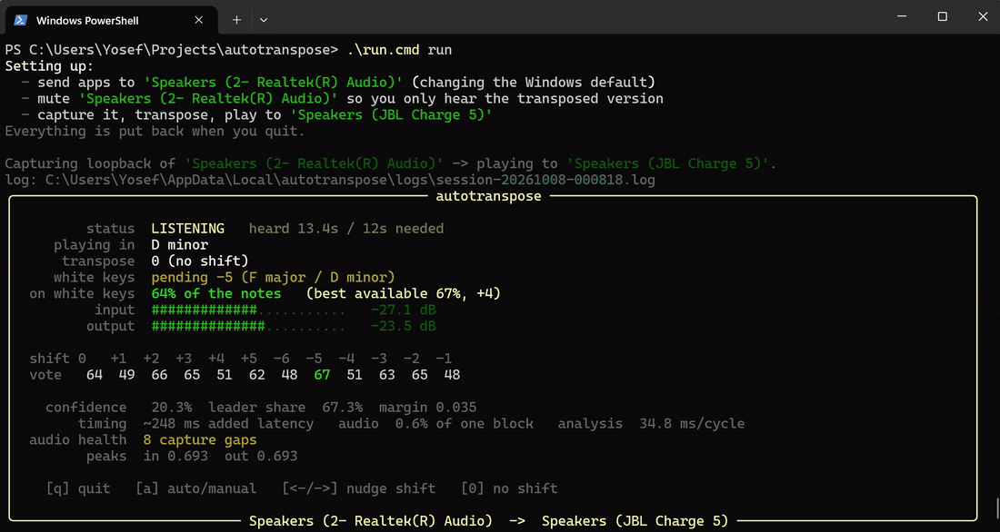

# autotranspose

Listens to whatever your computer is playing, works out the song's key, and
transposes it in real time so it lands on the white keys — C major / A minor.
Play along without touching a black note.

It captures the audio Windows is already playing, so it works with any source —
a streaming site in a browser, Spotify, YouTube — and needs no files, no API and
no account.

Built because I'm learning piano, can only play the naturals so far, and wanted
to play along with music that isn't in C.

**Windows only.** It depends on WASAPI loopback capture, and on Core Audio to set
up the routing for you. There is no macOS or Linux port.



*Listening (amber) while it gathers evidence, then locked (green): the song is
in A major, so it shifts up 3 semitones and 68% of the notes land on the
naturals. The shift is only applied once it is worth applying.*


## Install

```powershell
git clone https://github.com/YosefDM/autotranspose.git
cd autotranspose
.\run.cmd devices
```

`run.cmd` creates the virtual environment and installs dependencies on first use,
so that is the whole setup. Python 3.10+ required.

Then build the native pitch-shift engine, which is a large quality win and a
tenth of the CPU:

```powershell
native\build.bat
```

That needs MSVC Build Tools with "Desktop development with C++", and fetches two
MIT-licensed header libraries at pinned revisions. It is optional — without it
the app falls back to a pure-numpy phase vocoder and still runs.

## Quick start

```powershell
.\run.cmd run
```

That is the whole thing. No settings to change, no devices to pick.

Start it, then press play in 24Six. After about 13 seconds it locks on and the
music comes out of your listening device, transposed onto the white keys.

Other commands:

```powershell
.\run.cmd devices         # what can be captured and played to
.\run.cmd detect          # just name the key and the shift; plays nothing
.\run.cmd detect --plain  # log it over an album, to check it on your library
.\run.cmd restore         # undo settings if a run was killed before cleaning up
```

### Why `.cmd` and not `.ps1`

A default Windows install refuses to run `.ps1` scripts at all:

```
.\run.ps1 : File ...\run.ps1 cannot be loaded because running scripts is
disabled on this system.
```

`run.cmd` is a batch file, which the execution policy does not apply to, so it
works everywhere. `run.ps1` is still there if you prefer it and have scripts
enabled. Either of these also works with no launcher at all:

```powershell
.\.venv\Scripts\python.exe -m autotranspose run

# or allow local scripts for your user, once (no admin needed):
Set-ExecutionPolicy -Scope CurrentUser RemoteSigned
```

## What `run` does for you

With two output devices connected (say laptop speakers and a Bluetooth
speaker), it arranges the routing itself and puts everything back when you quit:

1. **You hear on whatever Windows is currently set to** -- that device is the
   default because it is what you listen on, so it is left alone as the output.
2. **Apps are pointed at the other device** by changing the Windows default
   output, so the music plays into something we can capture.
3. **That device is muted**, so you only hear the transposed version.
4. It captures that device's loopback, transposes, and plays to device 1.

The mute in step 3 works because of a quirk worth knowing:

> **Muting a device does not mute its loopback.** Measured here: muting the
> speakers left the captured signal at **0.967x** full level, while dragging the
> *volume slider* down to 5% cut it to **0.009x**. So the program mutes the
> device it captures from -- and you should never just turn it down.

Changing the default output and muting a device are real system changes, so they
are undone on exit, including on Ctrl-C. If the process is killed outright, the
undo information is also on disk: the next command notices and restores it, or
run `restore` yourself. The record carries the owning process id, so a second
instance will not yank the routing out from under one that is still running --
it says so and leaves the settings alone.

**If your music was already playing when you started**, pause and resume it. An
app with an open audio stream does not always follow a change of default output
device. The display says so when it sees no input.

### Overriding any of it

```powershell
# I want to hear on the laptop speakers instead
.\run.cmd run --hear-on "Realtek"

# Do not touch my audio settings; I have routed it myself
.\run.cmd run --no-auto-route --capture "CABLE Output" --output "Speakers"
```

Passing `--capture` or `--output` explicitly also turns the automatic setup off,
on the assumption that you are doing your own routing.

### Using a virtual cable instead

The cleanest setup for daily use, because a virtual cable never reaches a
speaker at all -- nothing to mute, and no chance of hearing the original:

1. Install [VB-CABLE](https://vb-audio.com/Cable/) (free, needs a reboot), or
   the MIT-licensed
   [Virtual Audio Driver](https://github.com/VirtualDrivers/Virtual-Audio-Driver).
2. **Settings -> System -> Sound -> Volume mixer**, set your browser or Spotify
   to output to **CABLE Input**.
3. Run it:

```powershell
.\run.cmd run --no-auto-route --capture "CABLE Output" --output "Speakers"
```

Only the app you re-routed goes through the transposer; system sounds stay put.

### Analyse only, no second device needed

```powershell
.\run.cmd detect
```

Names the key and the shift without playing anything, so it needs no routing at
all. Also the right mode for checking how well detection does on your music.

## How well does it work?

Measured, not guessed. Run `python tests/run_all.py` to reproduce.

| What | Result |
|---|---|
| Shift chosen correctly, 24 synthetic keys | 24/24 |
| Round trip (detect → shift → re-detect lands on C) | 24/24 |
| Pitch accuracy of the shifter | within 6 cents (Signalsmith), 2 cents (fallback) |
| Zero shift | bit-exact passthrough |
| Added latency | ~310 ms (120 ms shifter + 21 ms capture + ~170 ms ring/output) |
| Shifter CPU, stereo @ 48 kHz | 1.3% of one core (Signalsmith); 0.1% at zero shift |
| Whole audio thread | ~21% of its real-time budget |
| Time to lock onto a new song | ~13 s |
| Live loopback test, real sound card | 2/2 locked correctly |
| **Full `run` path on real hardware** | **PASS** - output captured back off the JBL reads as C major |
| Zero-argument `run` with auto-routing | **PASS** - locked -5 on a D-minor song, settings restored |

Those key-detection numbers are on synthetic test material, which is tidier
than real music — treat them as proof the pipeline is correct, not as a promise
about your library. Check it on real songs with
`python -m autotranspose detect --plain`.

## How the key is chosen

Not by naming the key. The detector asks **which shift puts the most of the music
on white keys**, and changes only when a change would gain at least 3 percentage
points of coverage (`--min-gain`).

That matters because naming the key is ambiguous in a way the goal is not. On a
real test song the two best answers were C minor (74.3% of energy on white keys)
and F minor (73.7%) — 0.6 points apart. Comparing those two against each other is
a coin toss, and the detector flipped between them four times in one song.
Comparing the best option against **what is already applied** is decisive:

```
no shift -> C minor   = +20.2 points   obviously worth it
C minor  -> F minor   =  -0.6 points   obviously not
```

So the hysteresis is not a tuned threshold any more, it falls out of the
objective, and the oscillation cannot happen. A genuine key change still moves
it, because that does cost many points.

Measured on two real songs, with settings chosen on the worse of the two
(`tools/tune.py`):

| | mid-song changes | time on the best shift |
|---|---|---|
| song in C minor | 1 (at 16 s) | 91% |
| song already in A minor | 0 | 100% |

and 24/24 correct on the synthetic key set with no extra changes, so it is
decisive without being wrong. The old key-profile method is still available with
`--objective template`.

It needs about 15 seconds before the first lock. A single estimate is not
trustworthy: early in a track the detector will sit at 94% confidence on an
answer a fifth away from the truth, so evidence has to accumulate before anything
is applied (`--min-heard`, `--window`, `--dwell`).

Votes are cast on the *shift*, not the key, which also makes the most common
detection error free: confusing a key with its relative major/minor (C major vs A
minor) needs the same shift either way. That is why the display often names the
relative major of the actual key — it is the same answer as far as your hands are
concerned.

## Controls while running

| Key | Does |
|---|---|
| `q` | quit |
| `a` | toggle auto-detect / manual hold |
| `←` `→` | nudge the shift a semitone (switches to manual) |
| `0` | force no shift |

`--bypass` passes audio through unshifted, to A/B the shifter's sound quality.

## Sound quality

The shifting is done by **Signalsmith Stretch** (MIT), a production-grade
real-time engine, built as a small DLL. A hand-written numpy phase vocoder is the
fallback when that DLL has not been built, so the app runs anywhere.

Build the DLL once:

```powershell
native\build.bat
```

It needs MSVC Build Tools ("Desktop development with C++"). Without it everything
still works on the fallback; `--engine vocoder` forces the fallback, `--engine
signalsmith` fails loudly if the DLL is missing, and the default `auto` prefers
Signalsmith.

Measured on real music at +4 semitones (`tools/offline_shift.py`,
`tools/quality.py`):

| | L/R correlation | level | distance to Rubber Band | added warble | CPU |
|---|---|---|---|---|---|
| input | 0.659 | — | — | — | — |
| numpy vocoder | 0.678 | −1.72 dB | 7.58 dB | +5.1 pts | 14.4% |
| **Signalsmith** | **0.666** | **−0.22 dB** | **6.61 dB** | **+1.4 pts** | **1.3%** |

A **zero shift is bit-exact**: it goes through a plain delay matched to the
engine's latency, so a song already in C major / A minor is passed through
untouched. Verified to the sample.

### Why it will never be transparent

Transposing a finished stereo mix means resynthesising everything in it, and some
artefact is inherent to that — no real-time algorithm avoids it. These were the
faults actually found by measurement, and fixed:

* **A zero shift was not a no-op.** The vocoder resynthesised from accumulated
  phase even at ratio 1.0, so a song needing no transposition was mangled anyway.
  Now a delay line.
* **The stereo image collapsed.** L/R correlation measured 0.654 going in and
  **0.038** coming out — the hollow, underwater sound — because the channels were
  shifted independently and drifted apart in phase.
* **Level fell away as the shift grew**, up to 6 dB, which is why it sounded
  thin. Overlap-add of phase-modified grains partly cancels, by an amount that
  depends on the material, so slow level matching corrects it instead of a fixed
  gain.

Two dead ends worth recording, so they are not retried:

* **Bigger windows and more overlap do not help.** n_fft 1024 to 8192 and overlap
  4 to 8 were measured; 2048/4 was the best and larger windows were worse. The
  remaining gap was algorithmic, which is what the native engine fixes.
* **"SNR against the ideal shifted waveform" is a worthless metric.** Rubber Band
  scores 0.21 dB on it and the numpy vocoder scores 5.18 dB. A pitch shifter is
  not obliged to reproduce a particular waveform phase, so that number says
  nothing about how it sounds. The metrics in the table above (channel
  correlation, level, distance to a known-good engine, envelope modulation) do
  track what is audible.

### If it still is not clean enough

Transposing the audio has a floor. The way to get genuinely perfect audio is not
to transpose it at all: on a **digital piano or MIDI keyboard**, use the
instrument's own TRANSPOSE button and let `autotranspose detect` just tell you the
number. The music stays bit-for-bit untouched. That is not an option on an
acoustic piano, which is why the audio path exists.

## Logs: working out why it sounded bad

Every run writes a log, no flags needed:

```
%LOCALAPPDATA%\autotranspose\logs\session-<timestamp>.log
```

The path is printed when the run starts and again when it ends. If something
sounded choppy, that file says why. A summary goes in every 5 seconds:

```
summary t=18.9s blocks=841 process_ms(p50/p95/p99/max)=(1.6, 4.5, 8.2, 51.3)
  load_p95=21.0% interval_ms(p50/p95/max)=(20.2, 30.2, 63.8) jitter=4.8ms
  ring(min/med/max)=(1024, 4096, 5120) (85.3ms) in_peak=0.133 out_peak=0.133
  gain=-0.4dB clipped=0 skew=-106.7ms drift=0 frames (0.0ms, 0.0 ppm over 15.0s)
  dropout_frames=0 (priming 8192) events={'capture_gap': 6, 'xfade': 1}
  -> nothing wrong in the numbers: no dropouts, no clipping, load fine.
```

The last line is the point: it reads the numbers and says what they mean. The
same verdict prints in the terminal when the run ends.

### Reading it by symptom

| It sounded like | Look for | Usually means |
|---|---|---|
| gaps, stuttering | `underrun`, `dropout_frames` > 0 | playback ran dry; raise `--ring-blocks` |
| a click every few seconds | `overrun`, `drift_ppm` | the two device clocks diverging |
| brief hiccups, irregular | `capture_gap` | the captured device under-ran, often the source app pausing |
| crackle on loud parts | `clip`, `out_peak` >= 1.0 | the shifter overshot; `--output-gain 0.8` |
| gritty or metallic throughout | `shift` magnitude | the shifter itself, not a dropout; big shifts sound worse |
| a stumble when the key changed | `xfade`, `shift_change` | the handover between shift values |
| a hitch every second or two | `analysis_ms`, `gc_pause` | the analyser or the GC stalling the audio thread |

`skew` is the fixed startup offset between the two streams and is harmless;
`drift` is the slope measured after a warmup, and that is the one that matters.
`priming` frames are silence emitted on purpose while the buffer fills, so
`dropout_frames` is the count of audio actually lost.

### More detail when you need it

```powershell
# a line per analysis cycle: stage timings, votes, confidence, queue depth
.\run.cmd run --log-level DEBUG

# watch it live instead of reading the file afterwards
.\run.cmd run --log-console

# per-block metrics as CSV, for plotting timing spikes
.\run.cmd run --diag-csv blocks.csv

# record what went in and what came out, to compare by ear
.\run.cmd run --record-wav .\capture
.\run.cmd analyse .\capture      # counts dropouts and clipping in those files
```

`--record-wav` is the one to reach for when the complaint is "it sounds wrong"
rather than "it drops out" -- listening to `input.wav` against `output.wav`
separates a shifter artefact from a plumbing fault immediately. `analyse` counts
the 10 ms windows that were loud going in and silent coming out, which is a
dropout you can point at.

The instrumentation itself stays off the audio path: the capture loop and the
output callback only write numbers into preallocated arrays (measured at 0.39 us
per block, 0.002% of the budget) and a separate thread does all formatting and
disk I/O. Logging from inside the audio path would cause the very glitches it is
meant to measure.

## Known limits

These are properties of the problem, not bugs:

- **Detection is not perfect on real music.** Songs with no clear tonality,
  heavy production or a modulating structure will be read wrong sometimes. Use
  `←`/`→` to correct it by hand when it is.
- **Mid-song key changes** are detected, but only after `--dwell` seconds, and
  re-shifting mid-song is itself audible.
- **Larger shifts sound worse.** A 6-semitone shift of a full mix is
  noticeably artefacted; 1–3 semitones is close to transparent. `--max-shift`
  caps it.
- **Minor keys still are not all-white.** Landing in A minor puts the notes on
  the naturals, but a harmonic minor raised 7th (G#) is still a black key. No
  amount of transposing fixes that — it is music, not software.
- **Transients smear a little.** The phase vocoder softens sharp drum hits.
  `--fft 1024` smears less and wobbles more; `--fft 4096` the reverse.

## How it is built

```
capture: soundcard, WASAPI loopback (blocking)
   |
   +--> audio thread --> PitchShifter (phase vocoder) --> RingBuffer
   |                         ^                               |
   |                         | semitones                     v
   +--> analysis thread      |              sounddevice OutputStream callback
         resample 48k->22.05k|                          (PortAudio)
         incremental chroma (librosa CQT)
         key profiles -> 24 key scores
         fold to 12 shift classes
         ShiftDecider (decaying votes + hysteresis)
```

Three threads. The audio thread only captures, shifts and hands off; it never
blocks on the analyser, passing audio through a queue it is allowed to drop. The
analyser runs every 1.5 s and takes ~90 ms. Playback is a PortAudio callback
pulling from a ring buffer, so neither side can stall the other.

### Capture and playback use different libraries, deliberately

Both choices were forced by measurement:

- **Capture is `soundcard`** because `sounddevice` 0.5.6 exposes no WASAPI
  loopback option here (its `WasapiSettings` takes only `exclusive`,
  `auto_convert` and `explicit_sample_format`).
- **Playback is `sounddevice`** because `soundcard`'s `Player.play()` costs a
  fixed ~9 ms per call on this machine, independent of block size. Feeding it
  one 1024-frame block at a time runs at **1.41x real time** and the device
  starves; 4096-frame blocks still miss at 1.06x. That is not a Bluetooth
  problem — the built-in Realtek output measured identically. `sounddevice`'s
  callback output sustains real time with **zero** underflows on both devices.
  Raising the Windows timer resolution with `timeBeginPeriod(1)` made no
  difference, so it is per-call overhead, not sleep granularity.

Symptom if you get this wrong: the audio thread sits at ~139% load, the loopback
racks up hundreds of capture gaps, and the corrupted audio makes the detector
pick a key three semitones off. That was the first real-hardware run.

The ring buffer holds 4 blocks (~85 ms). Capture and playback run on independent
clocks — genuinely independent across two devices, like a Bluetooth speaker — so
the fill level drifts. A small ring bounds the latency that drift can add, at the
cost of an occasional dropped block; both drops and underruns are counted and
shown in the display rather than hidden.

### Why the fallback shifter is hand-written

Rubber Band via `pedalboard` was the obvious first choice, and it does not work
for live use here:

- `pedalboard.PitchShift` fed block by block with `reset=False` emits two blocks
  and then **silence**. It only works on a whole signal at once.
- `pedalboard.io.AudioStream`, its real-time path, takes the output device
  **exclusively**, which makes its audio invisible to the WASAPI loopback this
  app captures from — so it cannot be used alongside loopback capture.
- The `rubberband` PyPI package needs the C library built; Signalsmith Stretch
  has no Python binding.

Signalsmith Stretch (see *Sound quality*) is the default and solves this
properly. When its DLL is not built, `shifter.py` falls back to the classic
frequency-domain pitch shifter in numpy:
estimate each bin's true frequency from its phase advance, scale those
frequencies, move the magnitudes, resynthesise with overlap-add. Analysis and
synthesis hops are equal, so N input frames always produce N output frames and
the tempo is untouched. It measures within 2 cents and costs ~2.6% of a core.

Shift changes hand over between two engines with an equal-power crossfade.
Measurement showed an abrupt ratio change on this engine is already click-free
(unlike Rubber Band, overlap-add keeps the amplitude continuous), so the
crossfade is a perceptual nicety rather than a necessity — `--no-crossfade`
turns it off and halves the CPU.

## Tests

```powershell
# Use the venv's interpreter, not whatever `python` resolves to.
.\.venv\Scripts\python.exe tests\run_all.py
```

That covers everything except the two audible tests, which drive the real sound
card and are worth running when you can hear the speakers:

```powershell
.\.venv\Scripts\python.exe tests\test_live.py
.\.venv\Scripts\python.exe tests\test_live_run.py --source "Realtek" --sink "JBL"
```

| File | Covers |
|---|---|
| `test_keydetect.py` | detection accuracy over 24 keys, incremental == offline, time to lock |
| `test_shifter.py` | pitch accuracy, latency constant across shifts, handover smoothness |
| `test_roundtrip.py` | detect → shift → re-detect lands on C; CPU load |
| `test_engine.py` | all three threads against a fake sound card |
| `test_diag.py` | instrumentation cost on the audio path, priming vs real dropouts, verdict logic |
| `test_autoroute.py` | routing plan, restore on exit, crash recovery, and the second-instance guard (Core Audio faked) |
| `test_live.py` | the real sound card, real loopback, detect only (audible) |
| `test_live_run.py` | the whole `run` path across two real devices; captures the app's own output back and key-detects it (audible) |

## Troubleshooting

**"Feedback loop" and it refuses to start.** Capture and output are the same
device. See *Audio routing* above.

**Input meter stays silent.** Most often the music was already playing when you
started, and the app kept its stream on the old device -- pause and resume it.
Otherwise check the music is going to the device named in the header; with a
virtual cable, confirm **Volume mixer** really moved the app to **CABLE Input**.

**"running scripts is disabled on this system."** You ran `run.ps1`. Use
`.\run.cmd` instead, or see *Why `.cmd` and not `.ps1`* above.

**My audio settings are wrong after a crash.** Run `.\run.cmd restore`. Any
command does it automatically if it finds an interrupted run recorded. If it
says another instance owns them, quit that one first (or `restore --force`).

**"Only one output device is active."** `run` needs somewhere to send the
transposed audio that is not the device it is capturing. Connect a Bluetooth or
USB speaker, or install a virtual cable. `detect` works without one.

**It locks onto the wrong key.** Try `--profile shaath` (tuned on recorded pop)
or `--profile temperley`, raise `--min-heard`, and correct by hand with `←`/`→`.
Log what it does across an album with `detect --plain` before changing settings.

**It sounds choppy or wrong.** Read the log -- see *Logs* above. The verdict at
the end of the run names the likely cause.

**"capture gaps" climbing in the display.** The loopback under-ran, usually
because the source paused. Harmless unless constant; a larger `--blocksize`
helps.

## Built on

* [Signalsmith Stretch](https://github.com/Signalsmith-Audio/signalsmith-stretch)
  and [signalsmith-linear](https://github.com/Signalsmith-Audio/linear) (MIT) —
  the real-time pitch shifter. Fetched at pinned revisions by
  `native/fetch_deps.bat`, not vendored here.
* [soundcard](https://github.com/bastibe/SoundCard) (BSD) — WASAPI loopback
  capture, the one thing it does that nothing else here could.
* [sounddevice](https://github.com/spatialaudio/python-sounddevice) (MIT) —
  callback-driven playback.
* [librosa](https://librosa.org/) (ISC) — the CQT behind the chroma features.
* [pycaw](https://github.com/AndreMiras/pycaw) (MIT) — muting and default-device
  switching through Core Audio.
* [rich](https://github.com/Textualize/rich) (MIT) — the terminal display.

Key-profile data comes from Krumhansl & Kessler (1982), Temperley (2001),
Albrecht & Shanahan (2013) and Sha'ath (libKeyFinder).

## Licence

MIT — see [LICENSE](LICENSE).

It captures the audio your own machine is already playing, the same way any
recording or streaming tool does, for your own practice. What you do with the
output is on you.
